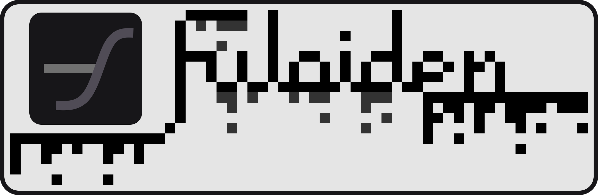

# fuloiden

**WELCOME TO THE PLACE WHICH IS NOT KNOWN BY ANYONE.**  
A editor for synthesis audio. you can perhaps make some characters pronounce what you want to make them say forcibly.
## Why did you start to make this?
This project was created before this repository was created because I just wanted it. That's all.  
Don't think everything is true.
## How to make a new fuloiden sound source
**Guide or some references will be made**  
You ought to check the [test fuloiden sound source](https://github.com/sharpedmimishee/utoshitesu).
## Engine System
Fuloiden uses a engine for adjusting and connecting each notes and so on.  

There is a list of engines by the creator:  
- dequidil (the name is from liquid) - The default engine for Fuloiden.  
- deopevarat (the name is from evaporate) - The creator's AI Engine for Fuloiden. It is not default engine because it is anticipated to be unstable and most outputs may be low quality.  
